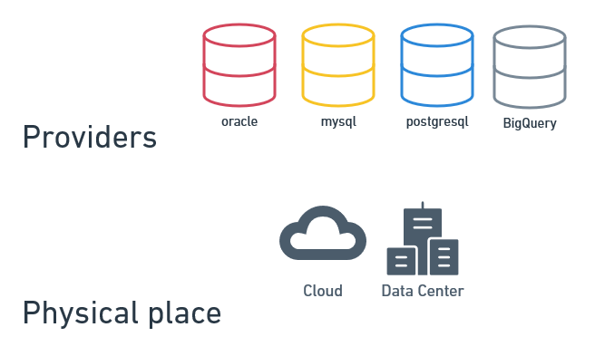
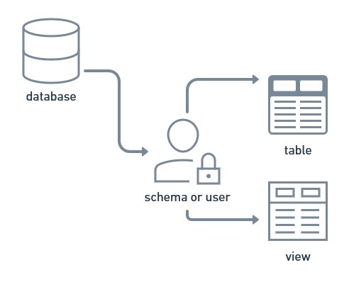
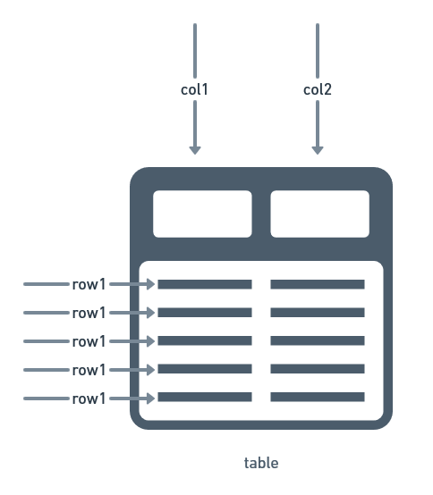

# 10 minutes to SQL for Data Science

This is a short guide using Structure Query Languaje (SQL) to understand Data Base and SQL context and common pattern expressions to build Data Science projects and more.

## Data Base Relational (DRE)



First, Data Base Relational (DRE) represent an concep to storage data, and exists many vendor as Oracle, Mysql, SqlServer, Auora, Google Big Query, Postgre SQL and others with their own engine piece of software and can be runned on server cloud and/or server on-premise and these represents the place to storage physicaly data.


Second, to interacte with database your Data Base Relational engine or Data Base (DB) you need to use SQL who is a declarative program languaje to write, read and change data who live in your database (DB).

Aclaration, exists other kinds of Data Base Models as documental, key-value, graph and others but not covered here, and for clarity, relational means is posible create a relations betwen tables and/or views and this is the most powerfull characteristic of DRE.

## Table Creation



In `data base (DB)` exists `schemas or users` who has defined permisions and them contains many kind of object as `tables` is a general-purpose data structure with represent physycal data writed in DB and consists of columns and rows, and `views` who looks pretty similar but It represnt a virtual version of a table, in other words, don't exist physycal on database and need to be calculate at moment.

Every `column` or `col` for short has a well defined `data type` as `chart, integer, timestamps...` and every `row` represent a `unique event or transaction`, in data science terms, column represent features and row represents observations.



In constrast with other program languajes, when you can start definig data structure and data sources in one setp, in SQL context, you need almost one table with data to start and if no exist, you need to do two steps:

1. First create a empty table with data type definition
2. Insert rows.

```sql
--create table
CREATE TABLE my_table (
    a   NUMBER,
    b   DATE,
    c   NUMBER(8,4),
    d   INTEGER,
    e   CHAR(32),
    f   CHAR(64)
);

-- instert data

```
